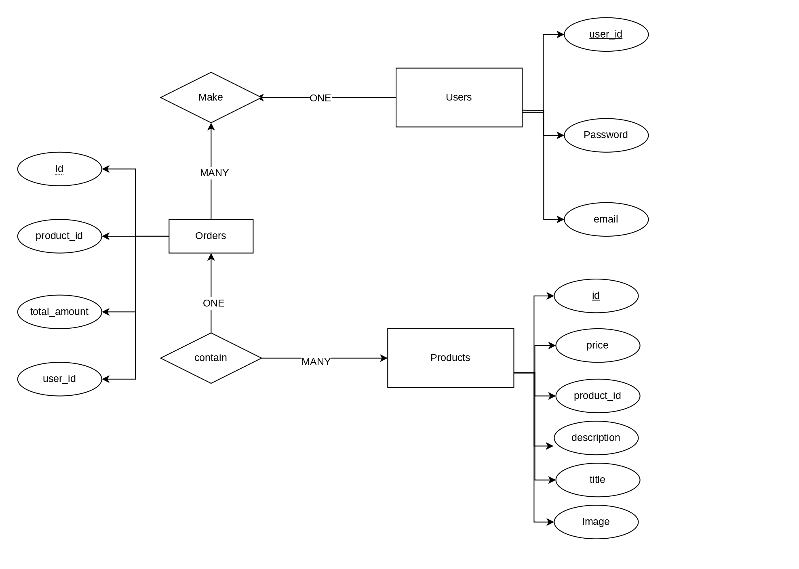

# Getting Started with Create React App

This project was bootstrapped with [Create React App](https://github.com/facebook/create-react-app).

## Getting Started

### First install needed packges
to install dependencies in Fronend
```
  cd Frontend/
  npm install
```
then install server dependencies
```
  cd Server
  npm install
```

### Running Server and React App

Running React App
```
  cd Frontend/
  npm start
```

Running Server
```
  cd Server/
  npm start
```

## Available Scripts

In the project directory, you can run:

### `npm start`

Runs the app in the development mode.\
Open [http://localhost:3000](http://localhost:3000) to view it in your browser.

The page will reload when you make changes.\
You may also see any lint errors in the console.

### `npm run build`

Builds the app for production to the `build` folder.\
It correctly bundles React in production mode and optimizes the build for the best performance.

The build is minified and the filenames include the hashes.\
Your app is ready to be deployed!

## DB

### Users Table
```sql
  CREATE TABLE `myecommerce`.`users` (
  `user_id` INT NOT NULL AUTO_INCREMENT,
  `username` VARCHAR(45) NOT NULL,
  `password` VARCHAR(45) NOT NULL,
  `email` VARCHAR(45) NULL,
  PRIMARY KEY (`user_id`),
  UNIQUE INDEX `id_UNIQUE` (`id` ASC) VISIBLE);
```

### Products Table
```sql
  CREATE TABLE `myecommerce`.`products` (
  `id` INT NOT NULL AUTO_INCREMENT,
  `product_id` INT NOT NULL,
  `title` VARCHAR(45) NOT NULL,
  `price` INT NOT NULL,
  `category` VARCHAR(45) NULL,
  `description` VARCHAR(45) NULL,
  `image` VARCHAR(45) NULL,
  PRIMARY KEY (`id`),
  UNIQUE INDEX `id_UNIQUE` (`id` ASC) VISIBLE);
```


### Orders Table
```sql

  CREATE TABLE `myecommerce`.`orders` (
  `id` INT NOT NULL AUTO_INCREMENT,
  `product_id` VARCHAR(45) NOT NULL,
  `total_amount` INT NOT NULL,
  `status` VARCHAR(45) NULL,
  PRIMARY KEY (`id`),
  UNIQUE INDEX `id_UNIQUE` (`id` ASC) VISIBLE);
```
### ERD


## Screenshots

### Shop


### Cart


### Log in


### Registartion


## Used Packges & APIs

### Frontend Side
- [fakestoreapi](https://fakestoreapi.com/) API used to get products
- [Axios](https://axios-http.com/docs/intro)
- [react-router-dom](https://reactrouter.com/en/main)

### Server Side
- [express](https://expressjs.com/)
- [cors](https://www.npmjs.com/package/cors)
- [bodyParser](https://www.npmjs.com/package/body-parser)
- [mysql](https://www.npmjs.com/package/mysql)

See the section about [deployment](https://facebook.github.io/create-react-app/docs/deployment) for more information.
